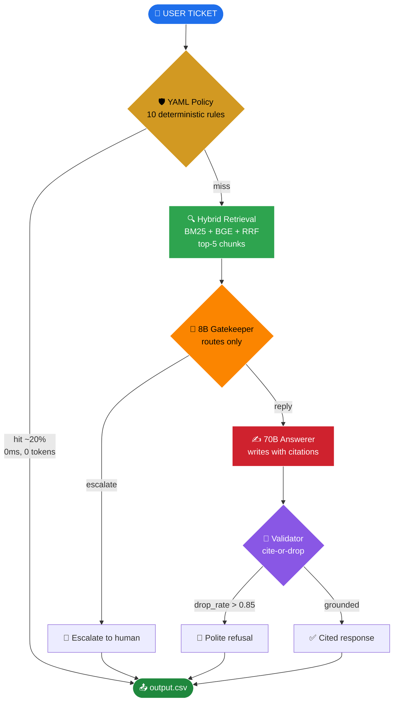

<div align="center">

# 🎯 HackerRank Orchestrate

### *A multi-vendor support-triage agent built in 24 hours*

[](https://git.io/typing-svg)

<br>


<br>


</div>

---

<div align="center">
  <h3>🧠 No web search. No parametric knowledge. No hallucinated policies.</h3>
  <i>774 corpus docs • 10 YAML rules • 1336 chunks • 0 fine-tuning • full reproducibility</i>
</div>

---

## ⚡ The Win

<table>
<tr>
<td width="50%" valign="top">

### 📊 Score Progression

| Iteration | Overall | Δ |
|---|:---:|:---:|
| 🪨 Dumb baseline | `0.340` | — |
| 🔨 Approach A — BM25 + rules | `0.699` | `+0.359` |
| 🤖 LLM v1 — single-shot RAG | `0.780` | `+0.081` |
| 🛡️ + self-service override | `0.821` | `+0.041` |
| 🎯 **+ YAML policy gate** | **`0.835`** | `+0.014` |

</td>
<td width="50%" valign="top">

### 🚀 What Wins

- ✅ **20%** of test rows resolved with **zero LLM tokens**
- ✅ Status `1.000` · Request Type `1.000`
- ✅ **14/14** prompt-injection attacks hard-blocked
- ✅ Crash-safe runner with auto-resume
- ✅ Model-family fallback (gpt-oss-20b) on rate-limit
- ✅ sha256 disk cache → reruns essentially free

</td>
</tr>
</table>

---

## 🏗️ Mental Model



<details>
<summary><b>📐 Plain-text version (always renders)</b></summary>

```
        ┌──────────────────────┐
        │   USER TICKET        │
        └──────────┬───────────┘
                   │
    ┌──────────────▼──────────────┐
    │  YAML POLICY (10 rules)     │   no LLM
    │  refunds, score-fix, PII…   │   ◄── 20% of tickets handled here
    └──────────────┬──────────────┘
                   │ no hit
    ┌──────────────▼──────────────┐
    │  RETRIEVAL                  │
    │  BM25 + BGE → RRF top-5     │   pulls 5 chunks from
    └──────────────┬──────────────┘   the 774-doc corpus
                   │
    ┌──────────────▼──────────────┐
    │  8B GATEKEEPER              │   ROUTES only
    │  emits: escalate? +         │   does NOT write text
    │  request_type + product_area│
    └──────┬───────────────┬──────┘
           │ escalate      │ reply
           ▼               ▼
    "Escalate to   ┌─────────────────────┐
     a human"      │ 70B ANSWERER        │   WRITES the response
                   │  reads chunks +     │   with [doc_id] citations
                   │  emits cited prose  │
                   └──────────┬──────────┘
                              │
                   ┌──────────▼──────────┐
                   │  VALIDATOR          │
                   │  drop uncited       │
                   │  sentences          │
                   └──────────┬──────────┘
                              │
                   ┌──────────▼──────────┐
                   │  output.csv row     │
                   └─────────────────────┘
```

</details>

---

## 🚀 Quickstart

```bash
# 1️⃣  Set up the environment
python -m venv .venv
. .venv/Scripts/Activate.ps1            # Windows; .venv/bin/activate on Linux/macOS
pip install -r code/requirements.txt
cp .env.example .env                     # add your GROQ_API_KEY

# 2️⃣  Build the retrieval index (one-time, ~7 min on CPU)
python -m code.scripts.build_index

# 3️⃣  Run the pipeline
python -m code.main \
    --input  support_tickets/support_tickets.csv \
    --output support_tickets/output.csv \
    --trace  runs/traces.jsonl

# 4️⃣  Score against gold (dev set)
python -m code.eval.harness \
    --predictions runs/llm_pred_full.csv \
    --gold        support_tickets/sample_support_tickets.csv
```

> 💡 The runner is **crash-safe** — every row is written as it's processed. Re-runs use the sha256-keyed LLM cache and are essentially free for tickets we've already answered.

---

## 🧬 Why This Design

<table>
<tr><th width="22%">Decision</th><th>Rationale</th></tr>

<tr>
<td>🛡️ <b>YAML policy<br/>pre-gate</b></td>
<td>10 hand-authored rules catch refund demands, score-manipulation, account-takeover, payment IDs, prompt injection — <b>deterministically, before any LLM call</b>. Auditable in the interview. Saved us when Groq's daily TPD ceiling hit at row 28.</td>
</tr>

<tr>
<td>🔀 <b>Two-LLM lane<br/>(8B router + 70B writer)</b></td>
<td>Cheap model handles routing, expensive model handles grounded generation. Different model families on Groq → <b>separate quota pools</b> → graceful rate-limit degradation via auto-fallback to <code>gpt-oss-20b</code>.</td>
</tr>

<tr>
<td>🔍 <b>Hybrid retrieval<br/>(BM25 + BGE + RRF)</b></td>
<td>Keyword and semantic matching combined via Reciprocal Rank Fusion at <code>k=60</code>. <b>Rank-based fusion sidesteps score-scale mismatch</b> without learned weights — critical when no labeled retrieval data exists.</td>
</tr>

<tr>
<td>📎 <b>Citation<br/>enforcement</b></td>
<td>Every factual sentence must carry a <code>[doc_id]</code> from the retrieved set. Validator drops uncited sentences; if &gt;85% drop, force polite refusal. <b>Structural defense against hallucination</b>, not just prompt-level pleading.</td>
</tr>

<tr>
<td>📏 <b>Eval harness<br/>first</b></td>
<td>Built scoring before any agent code. Every prompt change after that was <b>data-driven, not vibes</b>. Critical with only 10 dev rows — the only thing protecting against overfitting.</td>
</tr>

<tr>
<td>🎲 <b>Determinism</b></td>
<td><code>temp=0.2</code>, <code>seed=42</code>, pinned versions, sha256 cache, hash manifest. <b>Identical reruns produce identical CSVs</b>. Every load-bearing knob recorded in <a href="./code/index/manifest.json"><code>manifest.json</code></a>.</td>
</tr>

</table>

📚 Full design memo and trade-off analysis live in **[`code/README.md`](./code/README.md)**.

---

## 📁 Repository Layout

```
.
├── 📂 code/                            ← agent implementation
│   ├── 📄 README.md                    ← architecture deep-dive + interview prep
│   ├── 🚪 main.py                      ← CLI entry point
│   ├── 📂 agent/
│   │   ├── pipeline.py                 ← policy → retrieve → gate → answer → validate
│   │   ├── policy.py                   ← YAML compiler + rule matcher
│   │   ├── retrieval.py                ← BM25 + BGE + RRF fusion
│   │   ├── gatekeeper.py               ← 8B routing decision
│   │   ├── answerer.py                 ← 70B grounded writer
│   │   ├── validator.py                ← citation-or-drop enforcement
│   │   ├── schemas.py                  ← Pydantic + canonical CSV header
│   │   ├── corpus.py                   ← frontmatter-aware loader
│   │   ├── cache.py                    ← diskcache wrapper
│   │   └── baseline.py                 ← Approach A floor + fallback
│   ├── 📂 llm/
│   │   ├── groq_client.py              ← async + sync, semaphore + tenacity
│   │   ├── structured.py               ← JSON+Pydantic, retry on validation
│   │   └── 📂 prompts/
│   │       ├── gatekeeper.txt
│   │       └── answerer.txt
│   ├── 📂 eval/
│   │   ├── harness.py                  ← CLI scorer
│   │   ├── metrics.py                  ← per-column scorers
│   │   └── diff_report.py              ← markdown predicted-vs-gold
│   ├── 📂 policies/
│   │   ├── escalation.yaml             ← 10 hand-authored rules
│   │   └── prompt_injection_corpus.txt ← 14 jailbreak attacks (selftest 14/14)
│   ├── 📂 index/                       ← BM25 + BGE artifacts + manifest
│   └── 📂 scripts/                     ← build_index, run_pipeline, write_manifest, …
├── 📂 data/                            ← 774-doc corpus (HackerRank/Claude/Visa)
├── 📂 support_tickets/
│   ├── sample_support_tickets.csv      ← 10 dev rows with gold labels
│   ├── support_tickets.csv             ← 29 test rows (no labels)
│   └── output.csv                      ← agent predictions (29 × 8)
├── 📂 submission/                      ← code.zip + log.txt + output.csv ready to upload
└── 📂 runs/                            ← per-run prediction CSVs + JSONL traces
```

---

## 🧪 Live Demo Commands

<details open>
<summary><b>👉 What to type in the terminal during the AI Judge interview</b></summary>

```powershell
# Show the deterministic safety layer (instant, no LLM)
python -m code.agent.policy
# → 10 rules loaded, 14/14 prompt-injection corpus hard-blocked

# Re-score the dev set (uses cached predictions)
python -m code.eval.harness `
    --predictions runs\llm_pred_full.csv `
    --gold support_tickets\sample_support_tickets.csv
# → OVERALL: 0.835

# Run the full pipeline live on 3 sample rows (~10s with cache)
python -m code.main `
    --input support_tickets\sample_support_tickets.csv `
    --output runs\demo.csv `
    --trace runs\demo_traces.jsonl --limit 3

# Pretty-print the last trace JSONL (the audit trail)
python -X utf8 -c "import json; line = open('runs/demo_traces.jsonl', encoding='utf-8').readlines()[-1]; print(json.dumps(json.loads(line), indent=2))"
```

</details>

---

## 📜 Chat Transcript Logging

This repo ships with an [`AGENTS.md`](./AGENTS.md) that any modern AI coding tool (Cursor, Claude Code, Codex, Gemini CLI, Copilot, …) reads automatically. It instructs the tool to append every conversation turn to a single shared log file:

| Platform | Path |
|---|---|
| 🍎 macOS / 🐧 Linux | `$HOME/hackerrank_orchestrate/log.txt` |
| 🪟 Windows | `%USERPROFILE%\hackerrank_orchestrate\log.txt` |

Just use your AI tool normally — the log records itself.

---

## 📤 Submission

Three files uploaded to the [HackerRank Community Platform](https://www.hackerrank.com/contests/hackerrank-orchestrate-may26/challenges/support-agent/submission):

1. 📦 **[`submission/code.zip`](./submission/)** — agent code, prompts, YAML policy, manifest (no corpus, no inputs, no caches)
2. 📊 **[`support_tickets/output.csv`](./support_tickets/)** — 29 rows × 8 columns of predictions
3. 💬 **`%USERPROFILE%\hackerrank_orchestrate\log.txt`** — full chat transcript (also copied to `submission/log.txt`)

A 30-minute AI Judge interview follows. Results announced **May 15, 2026**.

---

## 🛠️ Stack

<div align="center">


</div>

<sub>
&nbsp;&nbsp;<b>LLMs:</b> Llama 3.1 8B Instant · Llama 3.3 70B Versatile · openai/gpt-oss-20b (fallback)<br>
&nbsp;&nbsp;<b>Retrieval:</b> rank-bm25 · sentence-transformers · BAAI/bge-small-en-v1.5 · numpy cosine + RRF<br>
&nbsp;&nbsp;<b>Infra:</b> diskcache (sha256-keyed) · tenacity (exp backoff on 429) · asyncio.Semaphore<br>
&nbsp;&nbsp;<b>Evaluation:</b> rouge-score · rapidfuzz · scikit-learn metrics<br>
</sub>

---

<div align="center">
  <sub>Built during the <b>HackerRank Orchestrate hackathon</b>, May 1–2, 2026 · Solo build, 24-hour budget</sub>
  <br>
  <sub>📧 Questions? Open an issue or reach out.</sub>
</div>
